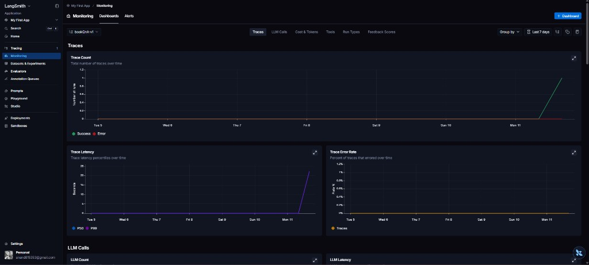
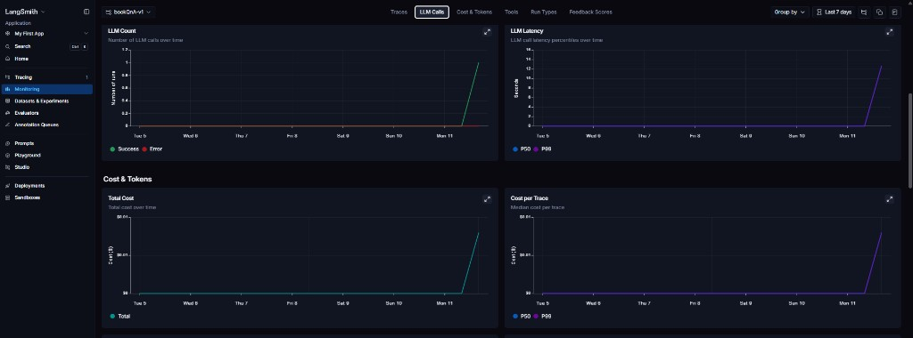
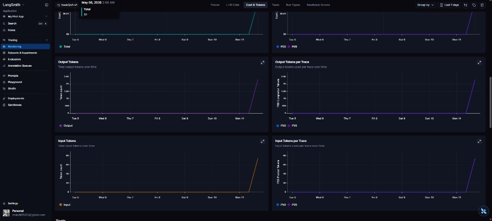
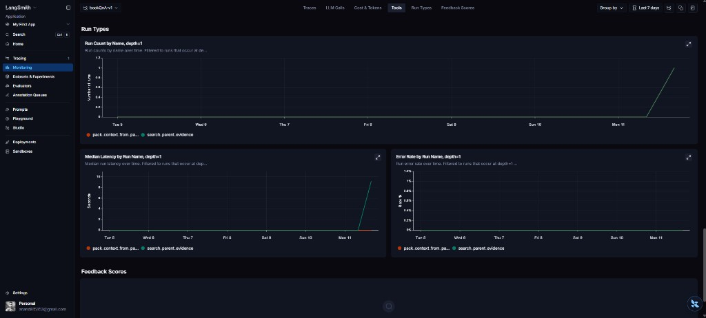

# BookQnA:  Grounded Knowledge Assistant for Long Technical PDFs or Books

[](https://github.com/OWNER/REPO/actions/workflows/ci.yml)

**Grounded multi-book PDF Q&A** with structured ingestion, hybrid retrieval, page-level citations, an eval harness, and a FastAPI + Jinja UI.

## Why this project

PDF books are a hard RAG target: long documents, layout noise, and readers who expect **precise page references**. Naive fixed-window chunking loses section boundaries; retrieval that is dense-only can miss exact phrases; answers without citations look confident but are not auditable. This app is a small end-to-end pipeline from upload to cited answers, with tests and evals so changes stay measurable.

## Architecture

Upload → parse (PyMuPDF) → structure → chunk → embed (Hugging Face or Gemini) → index (Chroma) → retrieve → answer → cite.


## Key features

- **Section-aware chunking** — respects document structure instead of blind fixed-size splits.
- **Citation-backed answers** — grounded responses with page- and source-level UI.
- **Multi-book filtering** — scope queries to one book or all indexed books.
- **Chat history** — follow-ups with bounded history (`MAX_HISTORY_*` in `app/settings.py`).
- **Eval harness** — repeatable retrieval/answer runs; see [`evals/README.md`](evals/README.md).
- **Automated tests** — API smoke and contracts via `pytest` (see below).

## Advanced RAG features (honest status)

These are **additive** paths on top of the default hybrid + Chroma pipeline. None are required for a working demo.

- **Cross-encoder reranking** — Implemented, **off by default** (`RERANKER_*` in `.env.example`). Uses sentence-transformers when enabled; failures fall back to pre-rerank order. `RERANKER_PROVIDER=mock` avoids downloads in tests.
- **SQLite FTS lexical retrieval** — Implemented, **off by default** (`ENABLE_LEXICAL_RETRIEVAL`). Populated at ingest; if the FTS table is empty after a restore or schema change, run `python -m app.services.lexical_index rebuild` from `bookQnA/`.
- **Planner vs baseline eval** — Implemented (`python -m app.evals.run_eval --compare-planner`). Local JSON reports only; needs your indexed corpus and API keys for answer mode.
- **LangSmith traced eval passes** — Implemented as a **small optional script** (`python -m app.evals.langsmith_eval`): runs the same traced retrieval path as the app, **not** hosted LangSmith datasets or evaluators. Local `run_eval` never calls LangSmith.
- **Retrieval / generation caches** — Implemented, **off by default**. In-process memory unless `REDIS_URL` is set (then Redis; the `redis` client is listed in `requirements.txt`). `docker-compose.yml` includes a `redis` service and defaults `REDIS_URL` to `redis://redis:6379/0` for the app container.

**How to run tests and evals:** use the `bookQnA/` directory as the working directory. Prefer the project virtualenv (for example `.\.venv\Scripts\python.exe -m pytest -q` on Windows). Eval commands match [`evals/README.md`](evals/README.md). Eight tests in this tree currently fail against **chat HTML strings** and **planner gate expectations** (UI / heuristic drift); the RAG add-ons above have dedicated tests that pass when run in isolation.

## Caching (optional)

Retrieval and generation caches are **off by default** (`ENABLE_RETRIEVAL_CACHE=false`, `ENABLE_GENERATION_CACHE=false` in `.env.example`). When enabled, the process uses an **in-memory** store unless `REDIS_URL` is set (then Redis is used for both). For local Redis on the host, publish port **6379** in Docker Desktop (or match your URL to the mapped port).

**What is cached**

- **Retrieval** (`ENABLE_RETRIEVAL_CACHE`): serialized parent-evidence results for `search_parent_evidence`, keyed by normalized query, selected `book_ids`, `top_k`, retrieval mode, hybrid weights, embedding provider/model, lexical index version, `CACHE_CONFIG_VERSION`, planner fingerprint, and reranker settings (`app/services/cache.py` + `retrieval.py`).
- **Generation** (`ENABLE_GENERATION_CACHE`): LLM answer text only for requests **without** recent chat history, keyed by normalized question, `book_ids`, model name, `PROMPT_VERSION`, a hash of the packed context string, planner mode, retrieval mode, and `top_k` (`qa.py`).

**Invalidation**

Cache keys are content hashes (prefixes `rq:` / `gen:`), so targeted per-book deletion is not stored. After **book delete**, **re-index enqueue** (`POST /books/{id}/ingest`), or **ingest start** (vectors wiped before re-embed), `invalidate_book(book_id)` clears **all** retrieval and generation entries and logs `cache_invalidate_book`. Programmatic helpers: `invalidate_all_retrieval()`, `invalidate_all_generation()`, `invalidate_generation_for_book(book_id)` (full generation flush; logs the triggering `book_id`).

**How to disable**

Set `ENABLE_RETRIEVAL_CACHE=false` and `ENABLE_GENERATION_CACHE=false`, or unset `REDIS_URL` and rely on defaults.

## Screenshots

| Home (upload + stats) | Books library |
|:-:|:-:|
|  |  |

| Chat (new) | Chat (citations + sources) |
|:-:|:-:|
|  |  |

**Demo GIF (optional):** add `docs/demo.gif` in this folder and link it here for a short walkthrough recording.

## Tech stack

FastAPI, LangChain, Gemini / Hugging Face embeddings, Chroma, SQLAlchemy, Jinja2, PyMuPDF, pytest.

## Observability

Optional **LangSmith** tracing is **off by default** (`ENABLE_LANGSMITH=false` in [`.env.example`](.env.example)). To turn it on locally, copy that file to `app/.env` and set the LangSmith block: `ENABLE_LANGSMITH`, **`LANGSMITH_API_KEY` or `LANGCHAIN_API_KEY`** (same secret, either name), `LANGSMITH_PROJECT`, and `LANGSMITH_TRACE_FULL_CONTEXT`. Do not commit keys or a real `.env`.

[LangSmith](https://smith.langchain.com/) is LangChain’s hosted observability product: traces land in a project (for example **`bookQnA-v1`**), where **Monitoring** charts summarize trace and LLM call volume, **P50 / P99 latency**, error rate, **USD cost**, and **input/output tokens** over time. The **Tools** view breaks down named runs (such as retrieval and context packing) by count, latency, and error rate—useful alongside the per-span names below.

| Monitoring: Traces | Monitoring: LLM calls |
|:-:|:-:|
|  |  |

| Cost & tokens | Tools (runs & latency) |
|:-:|:-:|
|  |  |

On startup, [`app/main.py`](app/main.py) runs `_configure_langsmith_env`, which sets tracing-related process environment when the feature flag and a key are present (nothing secret is logged). Conditional `@traceable` wrappers and safe trace metadata live in [`app/services/observability.py`](app/services/observability.py). When tracing is active (`ENABLE_LANGSMITH`, `langsmith` installed, and a key set), high-level spans include:

- `answer_question` — [`app/services/qa.py`](app/services/qa.py)
- `search_parent_evidence` — [`app/services/retrieval.py`](app/services/retrieval.py)
- `pack_context_from_parent_evidence` — [`app/services/context_packer.py`](app/services/context_packer.py)

**CI:** Keep tracing out of GitHub Actions. Do not set `ENABLE_LANGSMITH=true` in [`.github/workflows/ci.yml`](.github/workflows/ci.yml) and do not wire LangSmith API keys into this workflow via repository or organization secrets.

## Metrics

**Ingest time:** In server logs, find **`ingestion_completed`** — it records **`duration_ms`** for the full ingest. Per-stage timings appear on `ingestion_parse_completed`, `ingestion_structuring_completed`, and `ingestion_chunking_completed` (each with **`duration_ms`**); see [`app/services/ingest.py`](app/services/ingest.py).

**Query latency:** The structured log **`query_completed`** includes **`duration_ms`** for the whole `POST /query` handler ([`app/api/query.py`](app/api/query.py)). Alternatively, use **`http_request_finished`** with `path=/query` from the middleware in [`app/main.py`](app/main.py).

**Approximate p95 locally:** Run repeated identical requests and take a high percentile — for example, wall-clock seconds per request with `curl` (replace the question; numbers are an **example run on your machine**, not a benchmark claim):

```bash
for i in $(seq 1 50); do curl -s -o /dev/null -w "%{time_total}\n" -X POST http://127.0.0.1:8000/query \
  -H "Content-Type: application/json" \
  -d '{"question":"Your question here","top_k":4}'; done | sort -n | awk '{a[NR]=$1} END{n=NR; i=int(0.95*n+0.5); if(i<1)i=1; if(i>n)i=n; print a[i]}'
```

You can also collect **`duration_ms`** from `query_completed` lines over N runs and compute a percentile the same way.

## How to run

**Dependencies:** Install with `requirements.txt` **and** `constraints.txt` so the resolver stays on LangChain **0.3.x** (keep `langchain-core` below 1.0). See [docs/environment_setup.md](docs/environment_setup.md) for a clean conda env (Python **3.11** recommended on Windows) or a repair script for an existing `genAiEnv`.

### Local

1. Create and activate a virtual environment.
2. `python -m pip install --upgrade pip setuptools wheel` then `pip install -r requirements.txt -c constraints.txt`
3. Copy [`.env.example`](.env.example) to `app/.env` and set at least `GOOGLE_API_KEY` (and embedding keys as needed). On Gemini **free tier**, set `GEMINI_CHAT_MIN_INTERVAL_SECONDS` (for example `13`) to space answer/reformulation calls and reduce **RPM** `429` bursts; `GEMINI_CHAT_MAX_RETRIES` defaults to `6` (retry backoff can look slow when quota is exhausted). Free tier also enforces **per-model daily** caps (see [rate limits](https://ai.google.dev/gemini-api/docs/rate-limits)); if you hit `GenerateRequestsPerDayPerProjectPerModel`, switch `GEMINI_CHAT_MODEL` to another supported model for a fresh bucket, wait for the reset, enable billing, or run evals with `--mode retrieval` only.
4. `uvicorn app.main:app --reload`
5. Open [http://127.0.0.1:8000/](http://127.0.0.1:8000/) — Books, Chat, and **health**: [http://127.0.0.1:8000/health](http://127.0.0.1:8000/health) (`{"ok": true}`).

Switch embeddings with `EMBEDDING_PROVIDER=gemini` or `EMBEDDING_PROVIDER=huggingface` in `app/.env`. Full variable list: `.env.example`.

**Optional reranking** (off by default): set `RERANKER_ENABLED=true` and optionally `RERANKER_MODEL` / `RERANKER_TOP_N` (see `.env.example`). Uses a lazy-loaded sentence-transformers `CrossEncoder`; on load or inference failure the app logs a warning and keeps the pre-rerank ordering. `RERANKER_PROVIDER=mock` is for deterministic tests without downloading weights.

### Docker

From this directory (`bookQnA/`):

```bash
docker compose up --build
```

Or: `make up` / `make down`. Data persists under `./data` (mount in [`docker-compose.yml`](docker-compose.yml)). First run with Hugging Face may download model weights into that volume.

Set secrets via host environment, or a **`.env` file next to `docker-compose.yml`** (optional; git-ignored): Compose uses it for variable substitution and loads it into the `bookqna` container when present. Keys match [`.env.example`](.env.example) / `app/.env`.

## Evaluation

The harness (`python -m app.evals.run_eval`) reports metrics such as **correct book hit**, **correct page hit**, **chapter hit**, and **top-k evidence hit** over JSONL cases — see [`evals/README.md`](evals/README.md). Optional LangSmith-only traced passes over the same JSONL (retrieval path) are documented there as `python -m app.evals.langsmith_eval`; they do not affect local evals.

Example snapshot (sample report `evals/reports/eval_report_20260415T145507Z.json`, small `case_count`): retrieval summary included `correct_book_hit` 1.0 on 6 cases while **page- and chapter-level** hits were often weak — realistic for strict grounding on long PDFs without heavy tuning.

**Limitations:** eval set size, dependence on indexed books and API keys, and metrics that treat page/chapter labels as strict targets.

## Engineering tradeoffs

- **Section-aware chunking vs fixed windows** — preserves headings and locality so answers map to coherent passages; fixed windows split mid-thought and confuse citations.
- **Hybrid retrieval** — combines dense similarity with lexical signals (RRF-related settings in `app/settings.py`) to reduce “almost right semantic” misses on names and phrases. With `ENABLE_LEXICAL_RETRIEVAL=true`, chunk text is also written to **SQLite FTS5** at ingest; if FTS is empty (for example after a schema bump), run `python -m app.services.lexical_index rebuild` from the `bookQnA/` directory (optionally `--book-id <uuid>`).
- **Follow-ups** — recent Q/A turns are capped (`MAX_HISTORY_TURNS`, `MAX_HISTORY_CHARS`) to stay within context limits without dumping the whole thread; optional query planner paths are gated so latency and tool cost stay controlled.
- **Where grounding still fails** — tables, implicit “it/that” references, and wrong-page evidence when chunks align poorly; eval reports help catch regressions.
- **Why the eval harness** — compare retrieval modes and planner on/off using the same dataset so improvements are evidence-based (see planner vs baseline notes in `evals/README.md`).

## Roadmap

- Stronger page grounding and chapter / subchapter fidelity  
- Production-grade DB and vector backend, horizontal scaling  
- Authentication and multi-tenancy  
- Managed deployment templates (see below)

## Deployment notes

The repo already includes a [`Dockerfile`](Dockerfile) and [`docker-compose.yml`](docker-compose.yml). You can run the same image on a container host (Railway, Render, Fly.io, etc.) with a **persistent volume** for `data/` (SQLite + Chroma + uploads). Multi-instance replicas are not assumed today — shared object storage plus a managed vector DB would be the next step for HA.

## Core API Endpoints

- `POST /books/upload` (form-data: `title`, `file`, optional `auto_ingest`)
- `GET /books`
- `GET /books/{book_id}`
- `GET /books/{book_id}/status`
- `POST /books/{book_id}/ingest`
- `DELETE /books/{book_id}`
- `POST /query`

## Smoke Test Checklist

1. Upload one PDF from Home page.
2. Confirm it appears in Books page with status progression.
3. Trigger reindex from Books page.
4. Ask a question in Chat and verify citation cards render.
5. Delete the book and confirm it disappears from list.

## Automated Tests

- From **`bookQnA/`**: `make test` or `pytest -q` (use the project `.venv` so imports match CI, e.g. `.\.venv\Scripts\python.exe -m pytest -q` on Windows).
- Covers health, book lifecycle, query contracts, retrieval/rerank/cache, and eval helpers. A small set of **chat template** and **query-planner gate** assertions may be out of date relative to the UI and heuristics; fix or skip those when tightening CI.

---

**CI badge:** after you push to GitHub, edit the badge URLs at the top and replace `OWNER/REPO` with your user or organization and repository name.

**Git root note:** GitHub Actions only loads workflows from `.github/workflows` at the **repository root** (the folder that contains `.git`). This repo keeps CI at [`.github/workflows/ci.yml`](.github/workflows/ci.yml) under `bookQnA/`, which matches a remote whose root is the `bookQnA` directory. If your `.git` lives in a **parent** folder that only contains `bookQnA` as a subfolder, move the workflow back to that parent’s `.github/workflows/` and restore `working-directory: bookQnA` plus `cache-dependency-path: bookQnA/requirements.txt`.
