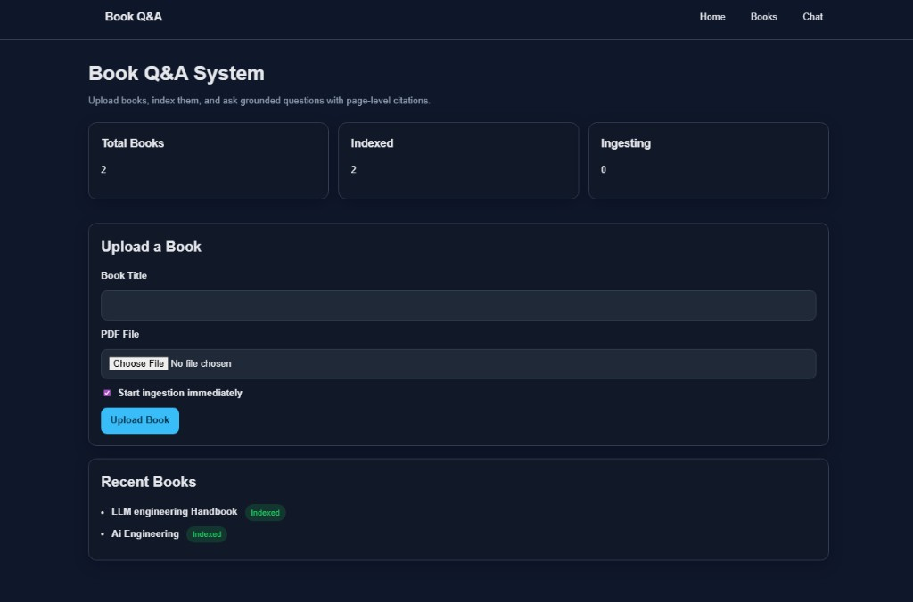
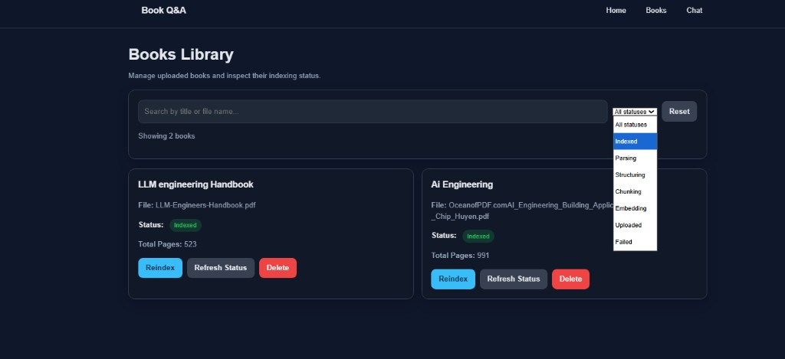
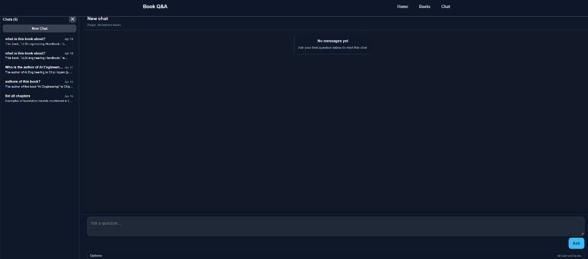
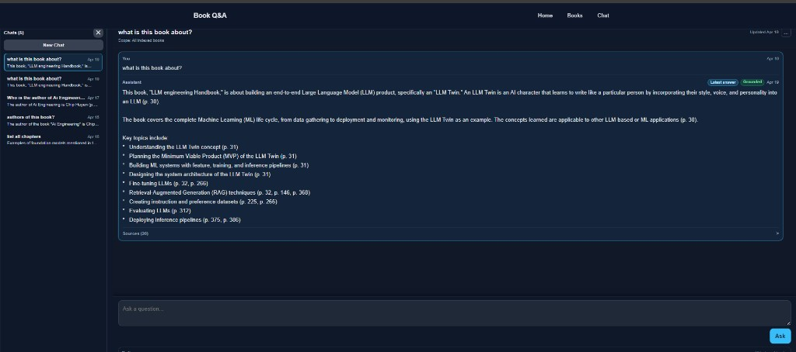

# BookQnA

[](https://github.com/OWNER/REPO/actions/workflows/ci.yml)

**Grounded multi-book PDF Q&A** with structured ingestion, hybrid retrieval, page-level citations, an eval harness, and a FastAPI + Jinja UI.

## Why this project

PDF books are a hard RAG target: long documents, layout noise, and readers who expect **precise page references**. Naive fixed-window chunking loses section boundaries; retrieval that is dense-only can miss exact phrases; answers without citations look confident but are not auditable. This app is a small end-to-end pipeline from upload to cited answers, with tests and evals so changes stay measurable.

## Architecture

Upload → parse (PyMuPDF) → structure → chunk → embed (Hugging Face or Gemini) → index (Chroma) → retrieve → answer → cite.


## Key features

- **Section-aware chunking** — respects document structure instead of blind fixed-size splits.
- **Citation-backed answers** — grounded responses with page- and source-level UI.
- **Multi-book filtering** — scope queries to one book or all indexed books.
- **Chat history** — follow-ups with bounded history (`MAX_HISTORY_*` in `app/settings.py`).
- **Eval harness** — repeatable retrieval/answer runs; see [`evals/README.md`](evals/README.md).
- **Automated tests** — API smoke and contracts via `pytest` (see below).

## Screenshots

| Home (upload + stats) | Books library |
|:-:|:-:|
|  |  |

| Chat (new) | Chat (citations + sources) |
|:-:|:-:|
|  |  |

**Demo GIF (optional):** add `docs/demo.gif` in this folder and link it here for a short walkthrough recording.

## Tech stack

FastAPI, LangChain, Gemini / Hugging Face embeddings, Chroma, SQLAlchemy, Jinja2, PyMuPDF, pytest.

## How to run

### Local

1. Create and activate a virtual environment.
2. `pip install -r requirements.txt`
3. Copy [`.env.example`](.env.example) to `app/.env` and set at least `GOOGLE_API_KEY` (and embedding keys as needed).
4. `uvicorn app.main:app --reload`
5. Open [http://127.0.0.1:8000/](http://127.0.0.1:8000/) — Books, Chat, and **health**: [http://127.0.0.1:8000/health](http://127.0.0.1:8000/health) (`{"ok": true}`).

Switch embeddings with `EMBEDDING_PROVIDER=gemini` or `EMBEDDING_PROVIDER=huggingface` in `app/.env`. Full variable list: `.env.example`.

### Docker

From this directory (`bookQnA/`):

```bash
docker compose up --build
```

Or: `make up` / `make down`. Data persists under `./data` (mount in [`docker-compose.yml`](docker-compose.yml)). First run with Hugging Face may download model weights into that volume.

Set secrets via environment or an env file consumed by Compose (see `docker-compose.yml`).

## Evaluation

The harness (`python -m app.evals.run_eval`) reports metrics such as **correct book hit**, **correct page hit**, **chapter hit**, and **top-k evidence hit** over JSONL cases — see [`evals/README.md`](evals/README.md).

Example snapshot (sample report `evals/reports/eval_report_20260415T145507Z.json`, small `case_count`): retrieval summary included `correct_book_hit` 1.0 on 6 cases while **page- and chapter-level** hits were often weak — realistic for strict grounding on long PDFs without heavy tuning.

**Limitations:** eval set size, dependence on indexed books and API keys, and metrics that treat page/chapter labels as strict targets.

## Engineering tradeoffs

- **Section-aware chunking vs fixed windows** — preserves headings and locality so answers map to coherent passages; fixed windows split mid-thought and confuse citations.
- **Hybrid retrieval** — combines dense similarity with lexical signals (RRF-related settings in `app/settings.py`) to reduce “almost right semantic” misses on names and phrases.
- **Follow-ups** — recent Q/A turns are capped (`MAX_HISTORY_TURNS`, `MAX_HISTORY_CHARS`) to stay within context limits without dumping the whole thread; optional query planner paths are gated so latency and tool cost stay controlled.
- **Where grounding still fails** — tables, implicit “it/that” references, and wrong-page evidence when chunks align poorly; eval reports help catch regressions.
- **Why the eval harness** — compare retrieval modes and planner on/off using the same dataset so improvements are evidence-based (see planner vs baseline notes in `evals/README.md`).

## Roadmap

- Stronger page grounding and chapter / subchapter fidelity  
- Production-grade DB and vector backend, horizontal scaling  
- Authentication and multi-tenancy  
- Managed deployment templates (see below)

## Deployment notes

The repo already includes a [`Dockerfile`](Dockerfile) and [`docker-compose.yml`](docker-compose.yml). You can run the same image on a container host (Railway, Render, Fly.io, etc.) with a **persistent volume** for `data/` (SQLite + Chroma + uploads). Multi-instance replicas are not assumed today — shared object storage plus a managed vector DB would be the next step for HA.

## Core API Endpoints

- `POST /books/upload` (form-data: `title`, `file`, optional `auto_ingest`)
- `GET /books`
- `GET /books/{book_id}`
- `GET /books/{book_id}/status`
- `POST /books/{book_id}/ingest`
- `DELETE /books/{book_id}`
- `POST /query`

## Smoke Test Checklist

1. Upload one PDF from Home page.
2. Confirm it appears in Books page with status progression.
3. Trigger reindex from Books page.
4. Ask a question in Chat and verify citation cards render.
5. Delete the book and confirm it disappears from list.

## Automated Tests

- `make test` or `pytest -q`
- Covers health, book lifecycle/status endpoints, and query contract behavior.

---

**CI badge:** after you push to GitHub, edit the badge URLs at the top and replace `OWNER/REPO` with your user or organization and repository name.

**Git root note:** GitHub Actions only loads workflows from `.github/workflows` at the **repository root** (the folder that contains `.git`). This repo keeps CI at [`.github/workflows/ci.yml`](.github/workflows/ci.yml) under `bookQnA/`, which matches a remote whose root is the `bookQnA` directory. If your `.git` lives in a **parent** folder that only contains `bookQnA` as a subfolder, move the workflow back to that parent’s `.github/workflows/` and restore `working-directory: bookQnA` plus `cache-dependency-path: bookQnA/requirements.txt`.
